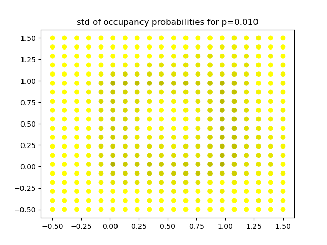

# background
toy problem training binary classifier on a unit square without dropout, then using drop out at inference time.

# install
conda create --name pytorch_env pytorch::pytorch nvidia::cudatoolkit conda-forge::numpy matplotlib

# run
conda activate pytorch_env
python main.py

# results

